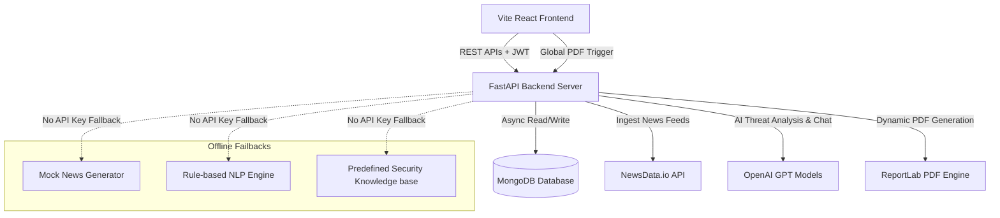

# AI Cyber Threat Intelligence Assistant

AI Cyber Threat Intelligence Assistant is a production-quality full-stack platform that automatically aggregates cybersecurity news, performs real-time AI risk analysis and threat classification, maps attack methodologies to the MITRE ATT&CK matrix, and compiles visual intelligence summaries for security operations teams.

---

## Architecture Diagram



---

## Database Schemas

The application operates on five collections inside the MongoDB `cyber_threat_intel` database.

### 1. `users` Collection
Stores security analyst accounts and permission scopes.
```json
{
  "_id": "ObjectId",
  "email": "String (Unique, Indexed)",
  "full_name": "String",
  "hashed_password": "String",
  "role": "String ('user' or 'admin')",
  "created_at": "ISODate",
  "updated_at": "ISODate"
}
```

### 2. `threats` Collection
Aggregates security bulletins, vulnerability reports, and AI risk evaluations.
```json
{
  "_id": "ObjectId",
  "title": "String (Text Indexed)",
  "source": "String",
  "published_date": "ISODate (Indexed)",
  "country": "String (Text Indexed)",
  "description": "String (Text Indexed)",
  "threat_type": "String (Text Indexed)",
  "organization": "String (Text Indexed)",
  "malware_name": "String (Text Indexed, Optional)",
  "cve_ids": "Array of Strings (Indexed)",
  "url": "String (Optional)",
  "ai_summary": "String (Text Indexed, Optional)",
  "severity": "String ('Critical' | 'High' | 'Medium' | 'Low')",
  "attack_type": "String (Optional)",
  "industry_target": "String (Optional)",
  "risk_score": "Integer (0-100)",
  "preventive_actions": "Array of Strings",
  "mitre_attack_mapping": "String (Optional)"
}
```

### 3. `chats` Collection
Maintains historical security analyst conversations.
```json
{
  "_id": "ObjectId",
  "user_id": "String (Indexed)",
  "messages": [
    {
      "role": "String ('user' | 'assistant')",
      "content": "String",
      "timestamp": "ISODate"
    }
  ],
  "updated_at": "ISODate"
}
```

### 4. `logs` Collection
Tracks security events, credential updates, and feed refreshes.
```json
{
  "_id": "ObjectId",
  "timestamp": "ISODate",
  "level": "String ('INFO' | 'WARNING' | 'ERROR')",
  "component": "String ('AUTH' | 'NEWS_FETCHER' | 'AI_SERVICE' | 'SYSTEM')",
  "message": "String"
}
```

### 5. `system_settings` Collection
Caches dynamic system keys set from the admin console.
```json
{
  "_id": "ObjectId",
  "key": "String ('api_keys')",
  "newsdata_api_key": "String",
  "serper_api_key": "String",
  "openai_api_key": "String",
  "openai_model": "String",
  "updated_at": "ISODate"
}
```

---

## API Endpoints Reference

### 1. Authentication (`/api/auth`)
* `POST /register`: Registers new analyst user account.
* `POST /login`: Receives credentials, returns token block.
* `GET /profile`: Loads active JWT credentials profile.
* `PUT /profile`: Updates display name or password.
* `POST /forgot-password`: Dispenses password recovery tokens.
* `POST /reset-password`: Commits password changes.

### 2. Threat Registry (`/api/threats`)
* `GET /`: Lists cataloged threats with search & severity filters.
* `GET /summary-stats`: Returns dashboard counter sums and alerts.
* `GET /{id}`: Decrypts detailed threat files.
* `POST /`: Manually logs threats (Admin only).
* `PUT /{id}`: Modifies registered threat details (Admin only).
* `DELETE /{id}`: Deletes threat reports (Admin only).

### 3. AI Chatbot (`/api/chat`)
* `POST /`: Commits prompt queries and retrieves AI advice.
* `GET /sessions`: Lists previous user session titles.
* `GET /sessions/{id}`: Loads chat logs history.

### 4. Aggregated Analytics (`/api/analytics`)
* `GET /overview`: Groups datasets for Recharts timeline and pie widgets.

### 5. Reports Manager (`/api/reports`)
* `GET /download`: Fetches statistics, constructs reportlab structure, and streams PDF binary attachments.

### 6. Control Panel (`/api/admin`)
* `GET /users`: Audits registered operator database.
* `DELETE /users/{id}`: Revokes credentials keys.
* `GET /logs`: Tail logs monitors.
* `POST /news/refresh`: Dispatches background threat ingestion threads.
* `GET /keys`: Loads current API configuration parameters.
* `POST /keys`: Commits dynamic credentials updates.

---

## Installation & Launch Guide

### System Prerequisite Checks
Confirm Node.js (v18+) and Python (v3.10+) are installed. A running MongoDB daemon is required on `localhost:27017`.

### 1. Launch FastAPI Backend Server
```bash
# Enter backend directory
cd backend

# Establish python virtual environment
python -m venv venv
venv\Scripts\activate # On Windows

# Install packages
pip install -r requirements.txt

# Start Development Hot-Reload Server
uvicorn app.main:app --reload --port 8000
```
FastAPI Swagger documentation will be available at `http://localhost:8000/docs`.

### 2. Launch Vite React Frontend
```bash
# Enter frontend directory
cd ../frontend

# Install dependencies
npm install

# Start Vite server
npm run dev
```
Open your browser and navigate to `http://localhost:5173`.

---

## Seeding Default Administrator Coordinates
At launch, the database automatically provisions the default Administrator user and seeds 8 initial threats:
* **Administrator Email**: `admin@cti.local`
* **Access Key (Password)**: `AdminPassword123!`

---

## Docker Compose Deployment
Build and run the entire multi-service suite (Frontend, Backend, and MongoDB Database) with a single command:
```bash
docker-compose up --build
```
The Frontend web console will bind to `http://localhost:80` (Standard HTTP).
The Backend API will bind to `http://localhost:8000`.
The MongoDB container database volume is stored in `cti_db_data`.
